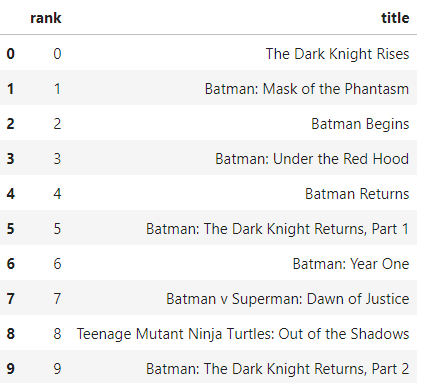
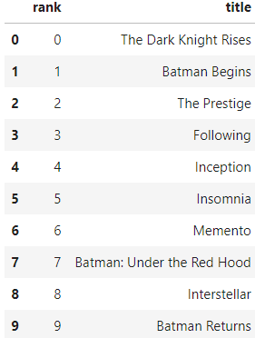
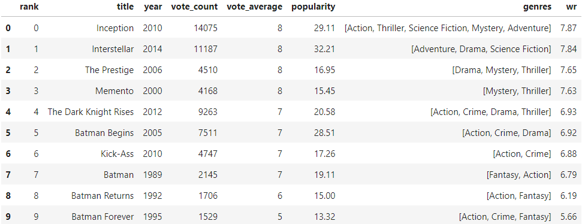

# Summary
🎥 [Application to recommend movies](https://moviesrecommenderapp-by-yosuke.streamlit.app/)

# Backgroud
Since I watch movies a lot, sometimes I run out of movies that I want to watch and looked up for some movies that I like.
Netflix can recommend some movies based on my preference, however, those don't always draw my attention.
Since I am a data scientist, I've been curious that how the recommendation algorithm works and wanted create recommendation algorithm which really focuses on my preference, I developed it and create an app.
This app will allow you to see the movies you might like based on the movies that you like considering movie content, director, actor/actress as well as popularity.
I am still learning recommendations and did not have user history data, it's not as accurate as you expected so I would appreciate if you provide me some feedbacks!

# How to use it
1. Select genre
2. Select the movie that you like so that the app can recommend some movies based on your preference
3. If there are no movies that you like, increase the number of options for movies

# Procedures of creating recommendation algorithm
0. Preprocessing the data
1. Creating ranking scores
2. Content-Based Filtering with using movies descriptions
    
    - The result shows batman series however it includes many animationed batman movies.
    - They might be recommended if you are a huge fun of animation however it can be assumed that most people who likes "The Dark Knight" likes real movies and movies created by Christopher Nolan 
3. Content-Based Filtering with using directors&actors  

    - The result shows more movies created by Christopher Nolan.
    - Most people might like this result better than pervious one.
4. Combining with ranking base algorithm and Content-Based Filtering
    
    - The resulst shows that more popular movies created by Christopher Nolan
    - Compared to the result from 3, it recommends higher movies which I think generally people like it. Plus, animated batman movies don't appear but old batman movies are still in the ranking, so a fun of batman might satistify with this result. 

# Procedures of developing app
## Requirement Design
- Recommending movies based on user preference
- Recommending movies based on user's character such as age, sex, etc.

## System Design&Architecture Design
### Architecture
- MVC model
- DB: SQLite
- Framework: Streamlit --> Django
- Deploy server: Streamlit --> Pythonanywhere

### UI design&feature design

### data design

## Module Design

# Keywords
- Recommendation system
- BERT
- Content-Based Filtering
- ML application

# TODO list
- Implementing database
- Implementing login functions
- Implementing Collaborative Filtering