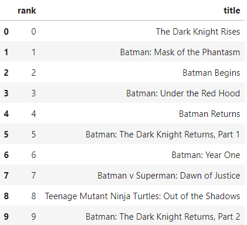
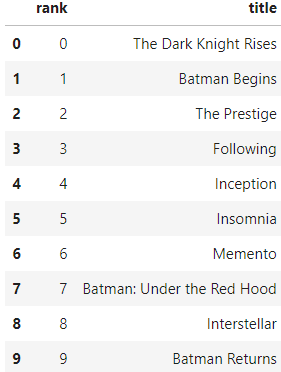
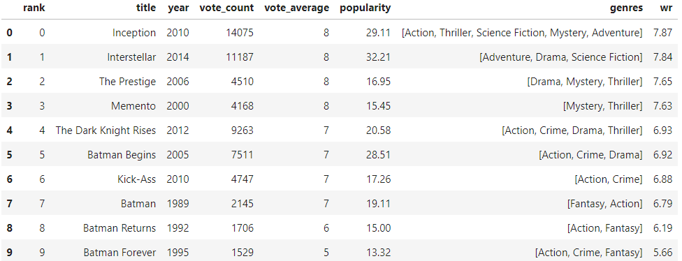

# Summary
🎥 [Application to recommend movies](https://moviesrecommenderapp-by-yosuke.streamlit.app/)

# Backgroud
Since I watch movies a lot, sometimes I run out of movies that I want to watch and look for some movies that I like.
Netflix recommends some movies based on my preference, however, I would like to decide on movies to watch based on reviews and popularity.
Because I am a data scientist, I've been curious about how the recommendation algorithm works and wanted to create the recommendation algorithm based on reviews, I developed it and created an app using the IMDb dataset.
This app will allow you to show the movies based on the movie that you like considering movie content, a director, an actor/actress as well as popularity.
I am still learning recommendations and did not have user history data, it's not as accurate as you expected so I would appreciate it if you provide me with some feedback!

# How to use it
1. Select genre
2. Select the movie that you like so that the app can recommend some movies based on your preference
3. If there are no movies that you like, increase the number of options for movies

# Procedures for creating recommendation algorithm
0. Preprocessing the data
1. Creating ranking scores
2. Content-based filtering using movie descriptions\
 \
    - The result shows the Batman series however it includes many animated Batman movies.
    - They might be recommended if you are a huge fan of animation however it can be assumed that most people who like "The Dark Knight" like real movies and movies created by Christopher Nolan

3. Content-Based Filtering with using directors&actors\ 
\
 - The result shows more movies created by Christopher Nolan.
 - Most people might like this result better than the previous one.

4. Combining with ranking base algorithm and Content-Based Filtering\
 \
    - The result shows that more popular movies created by Christopher Nolan
    - Compared to the result from 3, it recommends higher movies which I think generally people like. Plus, animated Batman movies don't appear but old Batman movies are still in the ranking, so those who are fun of Batman might be satisfied with this result. 

# Procedures for developing app
## Requirement Design
- Recommending movies based on user preference
- Recommending movies based on the user's character such as age, sex, etc.

## System Design&Architecture Design
### Architecture
- MVC model
- DB: SQLite
- Framework: Streamlit --> Django
- Deploy server: Streamlit --> Pythonanywhere

### UI design&feature design

### data design

## Module Design

# Keywords
- Recommendation system
- BERT
- Content-Based Filtering
- ML application

# TODO list
- Implementing database
- Implementing login functions
- Implementing Collaborative Filtering